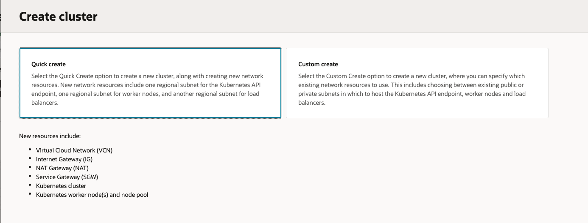
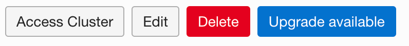
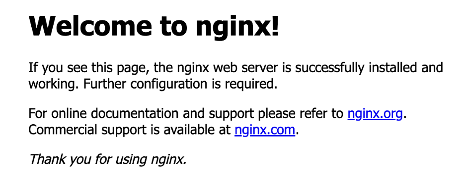
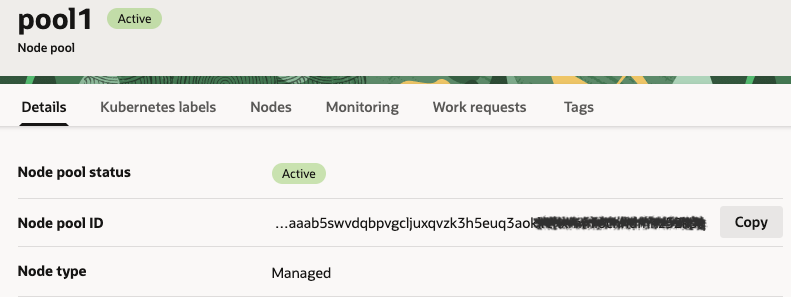
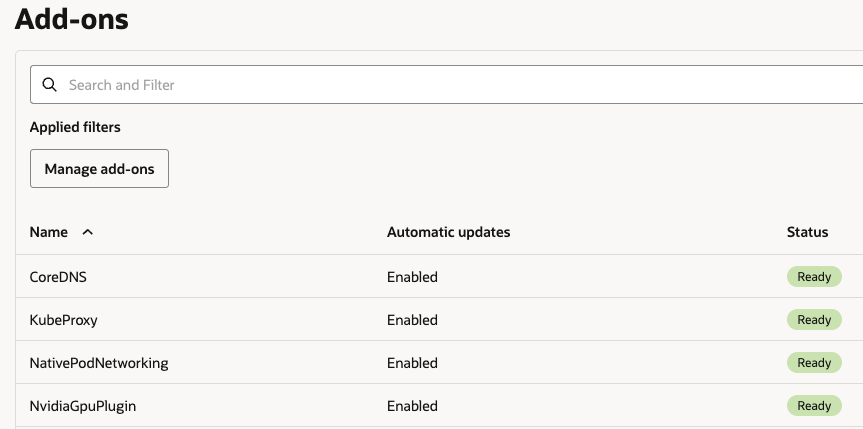
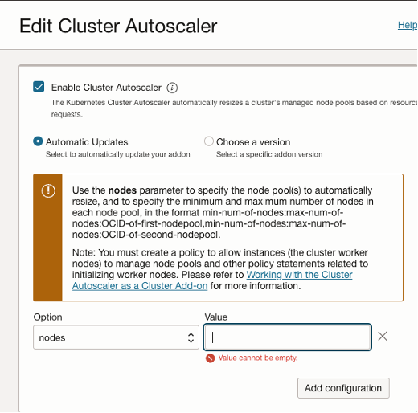
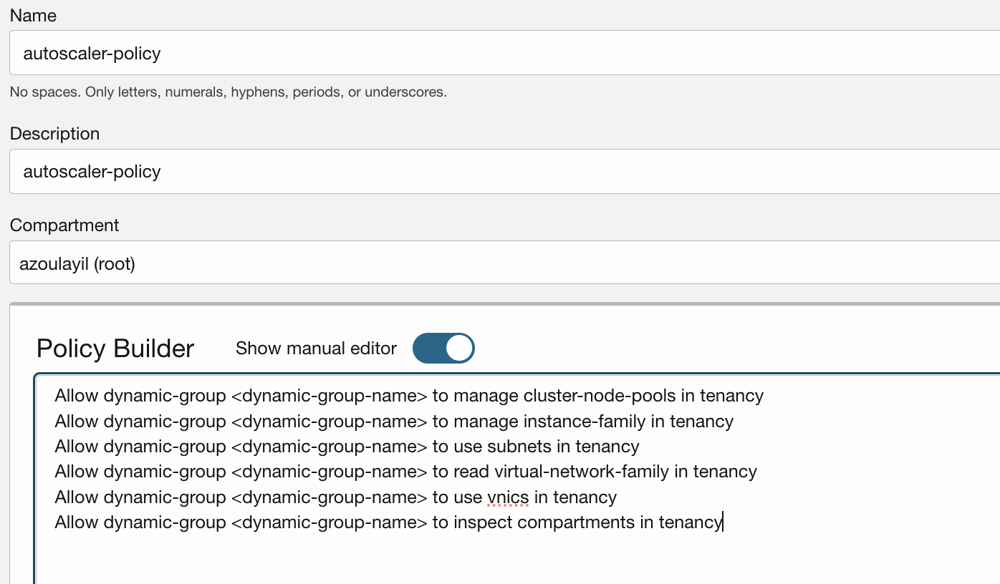
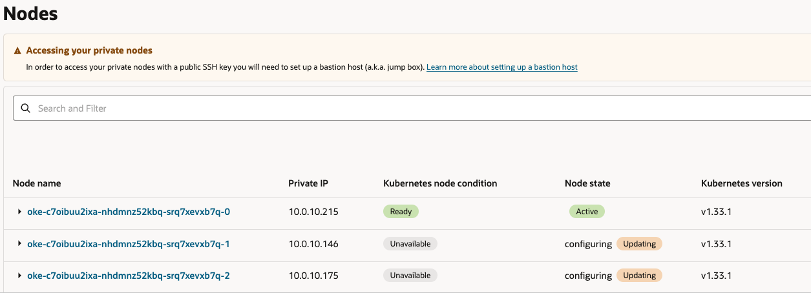

# OKE Workshop

<h1><ins>Day 2 – OKE – NGINX Web Application </ins></h1>

<h2><ins> TASK 1 - Create Your first OKE Cluster </ins></h2>

1. Create a Cluster (**Quick create**)

   1. Open the navigation menu and click **Developer Services**. Under **Containers & Artifacts**, click **OKE** and **Create Cluster**

      

    -	**Name**: Choose your cluster name
    -	**Compartment**: Your compartment
    -	**Kubernetes** version: v1.31.1 (latest)
    -	**Kubernetes API Endpoint Subnet**: Choose **"Public Endpoint"**
    -   **Node Type**: Choose **"Managed"**
    -	**Kubernetes Worker Nodes**: Choose **"Private Workers"**
    -	**Shape**: VM.Standard.E3.Flex (2 OCPUs, 8GB Memory)
    -	**Image**: Oracle Linux 8
    -	**Number of nodes**: 1
    Click **Next** and **"Create"**.

2. Go to the Cluster page, click on “**Access Cluster**”

      

3.	Wait for Creation & Launch “**Cloud Shell**” and paste the command grant you the access to your cluster.

4. **Clone the code repository**

    Clone the code into your device by running the following command:

        git clone https://github.com/OCISRAEL/OCIFundamentals-lab02.git

    Then, run the following command:

        cd OCIFundamentals-lab02/

5.	**Deploy the Application (NGINX) & Service type LoadBalancer**

    To deploy the web application and its service type LoadBalancer (which will expose the application to the public), run the following command:

        kubectl apply -f nginx.yaml

6.	**Validate the application is running**

    Validate the application is running by running the following command:

        kubectl get pods
    
    Did the status changed to **Running**?

 

7.	**Get the Service Public IP Address**

    Run the following command in order to get the Service Public IP Address:

        kubectl get service oci-fund-nginx

    
 
8. Copy the IP Address and paste it in the browser (http://<IP-ADDRESS\>)

    

***Bonus***

<h2><ins>TASK 2 – Enabling OKE Cluster Autoscaler</ins></h2>

1. Choose your cluster

2. Under **Resources**, Go to **Node Pools** & Choose Your **Pool**

3. Copy the **Node Pool OCID** for later reference

    

4. Under **Cluster Details**, Go to **Resources** ->  **Adds-ons** in the left panel menu

5. Click on Manage Add-On
    

6. Choose **Cluser Autoscaler** from the Adds-ons list

7. Tik the '**Enable Cluster Autoscaler**' box

8.	Choose **Automatic Updates**

9.	Follow the insructions and pay attention to the format. min=1, max=3 (single nodepool OCID value from step 3)
     & **Save Changes**

10.	Accept and close the window

11.	Access your **Cluster** again via cloudshell

12.	Run the command: 
        
        kubectl get pods -n kube-system

13.	Validate cluster autoscaler pod in **Running** state

 

<h2><ins>TASK 3 – Showcase Autoscaler Functionality </ins></h2>

1. Setting Up an Instance Principal  to Enable the Cluster Autoscaler Add-ons to access to **Node Pools** Require using Dynamic Group 

    **Important:** Use the same Dynamic Group name that have been created in Day 1 !!

    1. Navigate to Identity -> Policies

    2. Create a new policy and name it: autoscaler-policy (in your compartment)

    3. Paste the following statements:

            Allow dynamic-group <dynamic-group-name> to manage cluster-node-pools in tenancy
            Allow dynamic-group <dynamic-group-name> to manage instance-family in tenancy
            Allow dynamic-group <dynamic-group-name> to use subnets in tenancy
            Allow dynamic-group <dynamic-group-name> to read virtual-network-family in tenancy
            Allow dynamic-group <dynamic-group-name> to use vnics in tenancy
            Allow dynamic-group <dynamic-group-name> to inspect compartments in tenancy
    
    4. Save Changes
    
   

2. Access your **Cluster** via cloudshell

3. Run the following command to create multiple replicas of the nginx deployment:

        kubectl scale --replicas=30 deployment/oci-fund-nginx

4. Navigate to **Node Pools** & Choose Your **Pool**. Wait and observe how the node pool updates in the console

    

5. Verify new **Nodes** are under creation: 

        kubectl get nodes

6.  Verify all podes are in **Running** State: 
        
        kubectl get pods

7. Surf to your app with the external IP Address: 

        http://<EXTERNAL_IP_ADDRESS>

8. Scale down your application to a single **Pod**:

        kubectl scale --replicas=1 deployment/oci-fund-nginx

9. Wait few seconds. To verify **Nodes** are scaled to minimum, run:

        kubectl get nodes

<h3>CONGRATULATIONS!! YOU HAVE COMPLETED THE OKE LAB!</h3>