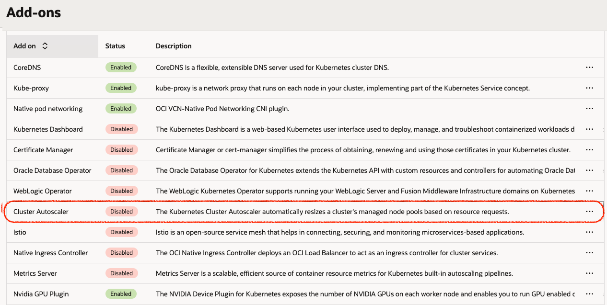

# OKE Workshop

<ins>**Lab 3 – OKE – NGINX Web Application** </ins>

- **Pre-requisites:**

    * Use the same account for the lab

1. Create an OKE Cluster (**Custom create**)

   1. Open the navigation menu and click **Developer Services**. Under **Containers & Artifacts**, click **OKE** and **Create Cluster**

      

    -	**Name**: Choose your cluster name
    -	**Compartment**: Your compartment
    -	**Kubernetes** version: v1.31.1 (latest)
    -	**Kubernetes API Endpoint Subnet**: Choose **"Public Endpoint"**
    -   **Node Type**: Choose **"Managed"**
    -	**Kubernetes Worker Nodes**: Choose **"Private Workers"**
    -	**Shape**: VM.Standard.E3.Flex (2 OCPUs, 8GB Memory)
    -	**Image**: Oracle Linux 8
    -	**Number of nodes**: 1
    Click **Next** and **"Create"**.

2. Go to the Cluster page, click on “**Access Cluster**”

      

3.	Wait for Creation & Launch “**Cloud Shell**” and paste the command grant you the access to your cluster.

4. **Clone the code repository**

    Clone the code into your device by running the following command:

        git clone https://github.com/OCISRAEL/OCIFundamentals-lab02.git

    Then, run the following command:

        cd OCIFundamentals-lab02/

5.	**Deploy the Application (NGINX) & Service type LoadBalancer**

    To deploy the web application and its service type LoadBalancer (which will expose the application to the public), run the following command:

        kubectl apply -f nginx.yaml

6.	**Validate the application is running**

    Validate the application is running by running the following command:

        kubectl get pods
    
    Did the status changed to **Running**?

 

7.	**Get the Service Public IP Address**

    Run the following command in order to get the Service Public IP Address:

        kubectl get service oci-fund-nginx

    
 
8. Copy the IP Address and paste it in the browser (http://<IP-ADDRESS\>)

    

***Bonus***

<ins>**Lab 4 – Deploy OKE Cluster Autoscaler </ins>

**TASK 1 - Enabling Auto Scaler**

1. Choose your cluster

2. Click on add-on in the left panel menu
    

3. Click on Manage Add-On

4. Check the enable autoscaler box

5.	Choose Cluster Autoscaler

6.	Follow the insructions and pay attention to the format. min=1, max=3 (single nodepool)
    

7.	Accept and close the window

8.	Access your cluster again via cloudshell

9.	run the command: 
        kubectl get pods -n kube-system

10.	Validate cluster autoscaler pod in up & running

    
    Deploy the OKE Cluster Autoscaler by using the following documentation:
    
    https://docs.oracle.com/en-us/iaas/Content/ContEng/Tasks/contengusingclusterautoscaler.htm#Working_with_the_Cluster_Autoscaler

	Follow the instructions and validate that the number of nodes increased on the cluster.
