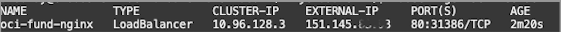

<h2><ins> TASK 1 - Create Your first OKE Cluster </ins></h2>

1. Verify you are in **Israel Central** Region

2. Create a Cluster (**Quick create**)

   1. Open the navigation menu and click **Developer Services**. Under **Containers & Artifacts**, click **OKE** and **Create Cluster**

   2. Choose **Quick Create** and **Proceed**

      

    -	**Name**: OKE-lab
    -	**Compartment**: demo
    -	**Kubernetes** version: v1.33.1 ( or latest available)
    -	**Kubernetes API Endpoint Subnet**: Public Endpoint
    -   **Node Type**: Managed
    -	**Kubernetes Worker Nodes**: Private Workers
    -	**Shape**: VM.Standard.E4.Flex (2 OCPUs, 8GB Memory)
    -	**Image**: Default value
    -	**Number of Nodes**: 1  

    Click **Next**
    
    3. Review and Click **Create cluster**.

3. Proceed with **Enhanced Cluster Features** and click **Continue**

4. Once the cluster creation is initiated, you can **Close** the creation window

5. Wait for the cluster status to change to **Active**

6. Go to **Quick start:Deploy sample app** tab. Click on “**Access Cluster**”

      

7. Follow these steps:
    1. Choose **Cloud Shell Access**

    2. Copy the **Access command** to your clipboard

    3. Lunch **Cloud Shell**

    

8. Paste the **Access Command** into the CLI screen to gain access to your cluster.

9. Confirm that the **Node Pool** was created with a single server:

        kubectl get nodes

10. Clone the code repository:

        git clone https://github.com/OCISRAEL/OCIFundamentals-lab02.git

    Then, run the following command:

        cd OCIFundamentals-lab02/

11.	Deploy the **NGINX** application 

    To deploy the web application and its LoadBalancer service (which exposes the application to the public), run:

        kubectl apply -f nginx.yaml

12.	Validate that the application is in **Running** state

        kubectl get pods
    
    Did the status change to **Running**?

 

13.	**Get the Service Public IP Address**

        kubectl get service oci-fund-nginx

    
 
14. Copy the **External-IP** address and paste it into your browser (http://<IP-ADDRESS\>)

    

15. Congratulations! You have created your first Kubernetes app hosted in a pod on OKE.