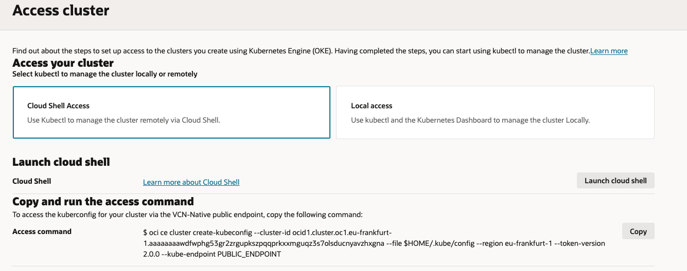

<h2><ins> TASK 1 - Create Your first OKE Cluster </ins></h2>

1. Create a Cluster (**Quick create**)

   1. Open the navigation menu and click **Developer Services**. Under **Containers & Artifacts**, click **OKE** and **Create Cluster**

      

    -	**Name**: OKE-lab
    -	**Compartment**: demo
    -	**Kubernetes** version: v1.33 ( orl latest available)
    -	**Kubernetes API Endpoint Subnet**: Public Endpoint
    -   **Node Type**: Managed
    -	**Kubernetes Worker Nodes**: Private Workers
    -	**Shape**: VM.Standard.E4.Flex (2 OCPUs, 8GB Memory)
    -	**Image**: Default Value
    -	**Number of nodes**: 1
    Click **Next**
    
    2. Review and Click **Create cluster**.

2. Proceed with **Enhanced Cluster Features** and click **Continue**

3. Once the cluster creation is initiated, you can **Close** the creation window

4. Wait for the cluster status to change to **Active**

5. Go to **Quick start:Deploy sample app** tab. Click on “**Access Cluster**”

      

6. Follow this steps:
    1. Choose **Cloud Shell Access**

    2. Copy the **Access command** to your clipboard

    3. Lunch **Cloud Shell**

    

7.	Paste the command in the CLI screen that will grant you the access to your cluster

4. **Clone the code repository**

    Clone the code into your device by running the following command:

        git clone https://github.com/OCISRAEL/OCIFundamentals-lab02.git

    Then, run the following command:

        cd OCIFundamentals-lab02/

5.	**Deploy the Application (NGINX) & Service type LoadBalancer**

    To deploy the web application and its service type LoadBalancer (which will expose the application to the public), run the following command:

        kubectl apply -f nginx.yaml

6.	**Validate the application is running**

    Validate the application is running by running the following command:

        kubectl get pods
    
    Did the status changed to **Running**?

 

7.	**Get the Service Public IP Address**

    Run the following command in order to get the Service Public IP Address:

        kubectl get service oci-fund-nginx

    
 
8. Copy the IP Address and paste it in the browser (http://<IP-ADDRESS\>)

    