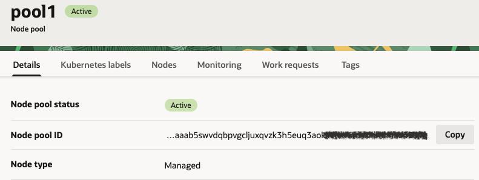

<h2><ins>TASK 2 – Enabling OKE Cluster Autoscaler</ins></h2>

1. Choose the cluster you created in **Task 1**

2. In the top panel click the **Node pools** tab, then click **pool 1**

3. Copy the **Node Pool ID** (You will need it later)

    

4. Return to the **Cluster Details** page

5. Select **Add-ons** tab in the to panel

6. Click on **Manage add-ons**

    

7. Select **Cluser Autoscaler** and click the **3 dots** to edit

    

8. Tick the '**Enable Cluster Autoscaler**' button

9.	Choose **Automatic Updates**

10.	Follow the instructions and enter the values in the correct format: min=1, max=3 (Use the Node Pool ID value copied in step 3)
    
    
    **Save Changes**

11.	Close the window

12. Verify that the **ClusterAutoscaler** service is in **Ready** state

13.	Access your **Cluster** again via Cloud Shell

14.	Run the following command to validate creation of the **AutoScaler**: 
        
        kubectl get pods -n kube-system

15.	Verify that the **cluster-autoscaler** pod is in **Running** state